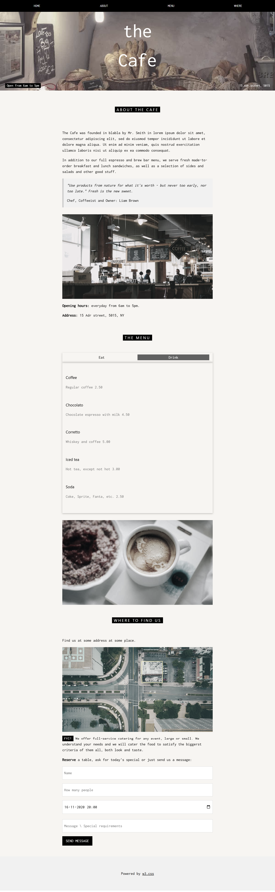
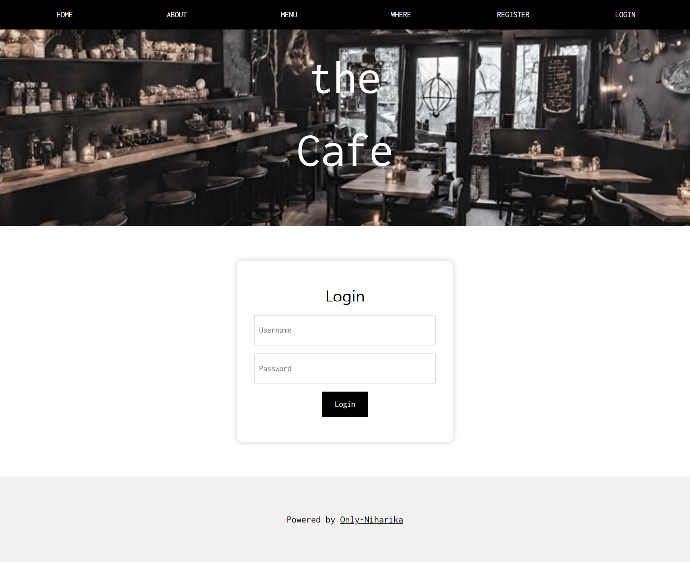
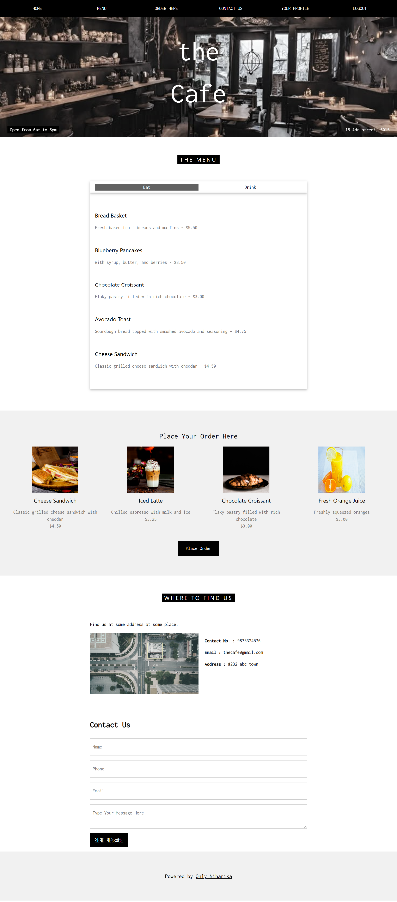
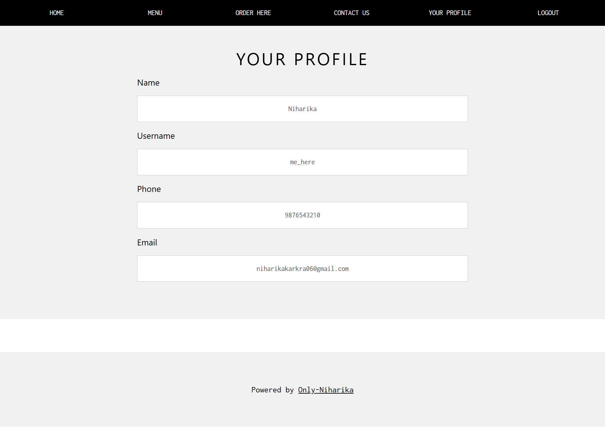

# ☕ Café Management Website  

A simple and responsive café website template enhanced with **PHP**, **MySQL**, **HTML**, **CSS**, and **JavaScript** to provide dynamic features like user login and registration.  

## 🚀 Features  
- **User Registration & Login** with database authentication  
- **Responsive Design** (works on desktop & mobile)  
- **Menu Display** with categories  
- **Contact Form** with backend handling  
- **Customizable Café Content** (images, menu, details)  

## 🛠️ Tech Stack  
- **Frontend:** HTML, CSS, JavaScript  
- **Backend:** PHP  
- **Database:** MySQL  

🙌 Credits
Template Design: Adapted from W3Schools Café Template

Development & Backend: Only-Niharika

## 📸 Screenshots

**Before Modifications**

**After Modifications**

**My Addons 1**

**My Addons 2**

**My Addons 3**

**My Addons 4**

## 📂 Project Structure
Project-Cafe/
│
├── index.php # Homepage
| admin
├── index.php # User login
├── register.php # User registration
├── image/ # Images
├── config/ # Database connection file
├── session.php # Session start
├── database.sql # Database schema & sample data
└── README.md # Project documentation

yaml
Copy
Edit

---

Import the database

Open phpMyAdmin and create a new database.

Import the provided database.sql file.

Configure database connection

Open config/db.php

Update with your local server credentials:

php
Copy
Edit
$servername = "localhost";
$username = "root";
$password = "";
$dbname = "your_database_name";
Run the project

Start a local server (XAMPP / WAMP / MAMP)

---

🙌 Credits
Template Design: Adapted from W3Schools Café Template

Development & Backend: Only-Niharika